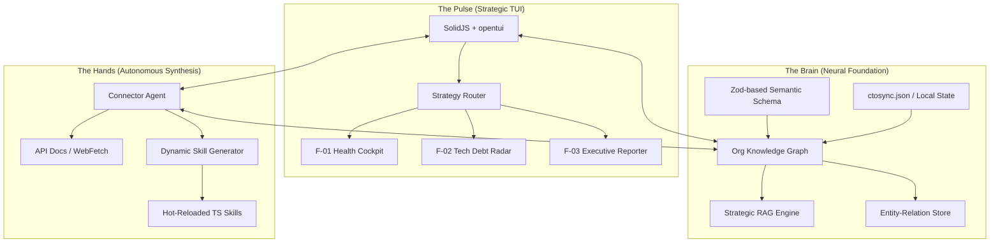

# 🚀 CTOSync: The Operating System for Technical Leaders
> **Version:** 1.5 (Enterprise Blueprint)
> **Status:** Phase 0 — Neural Foundation
> **Mission:** Transform high-entropy engineering data into high-leverage strategic leverage via an Agent-Native Command Center.

---

## 🏗️ North Star Architecture: The Trinity
CTOSync is a distributed agentic system built on three architectural pillars that separate it from generic "AI wrappers":

---

## 🗺️ Execution Roadmap: The Path to Global Scale

### Phase 0: The Neural Foundation — "Semantic Grounding" `[Active]`
**Goal:** Establish a deterministic context layer that allows agents to reason about teams, code, and business value.

| Task ID | Task Description | Technical Specification |
| :--- | :--- | :--- |
| **TSK-001** | **Universal Org Schema** | Define Zod-validated `Entity` and `Relation` types. Support for `Team`, `Contributor`, `Repository`, `Epic`, `Decision`, and `OKR`. |
| **TSK-002** | **Zero-Config Ingestor** | Implement `JSONIngestor`. Automate organizational bootstrapping via `ctosync.json`. |
| **TSK-003** | **Strategic RAG Layer** | Integrate the `query_org_graph` tool into the `ctosync` agent loop. Ground all strategic advice in existing entity relations. |

---

### Phase 1: MMP — "Strategic Visibility" `[P1]`
**Goal:** Deliver the first high-leverage "Wow" moment where the TUI renders cross-tool insights.

#### 📊 F-01: TUI Health Cockpit (DORA-Native)
- **Engine**: Dynamic aggregation of PR/CI/CD data via the Connector Agent.
- **TUI UI**: Multi-column dashboard with high-density ASCII Sparklines for `Lead Time` and `Change Failure Rate`.
- **Logic**: Implement "Contextual Drift" detection (e.g., "The 'Auth' team is contributing to 'Marketing' repos—is this intentional?").

#### 🤖 F-02: Connector Agent Synthesis Alpha
- **Workflow**:
  1. Input: `/connect greenhouse`
  2. Research: Agent uses `webfetch` to scrape API documentation.
  3. Synthesis: Agent writes TypeScript Skill + Zod validation schema.
  4. Verification: Agent generates a `connection.test.ts`, runs `bun test`, and iterates on handshakes.
- **Runtime**: Dynamic injection of the generated Skill into the agent's available toolset.

---

### Phase 2: V1 — "Operational Command" `[P1]`
**Goal:** Automate the high-admin overhead tasks of technical leadership.

#### 🕵️ F-03: Tech Debt Radar (Architectural Observability)
- **Tech**: Integration with `ast-grep` and `oxlint` for semantic code analysis.
- **Output**: A "Remediation Roadmap" prioritized by **Business ROI** (Estimated eng-hours saved vs. complexity).
- **Agentic Action**: "Summarize our top 3 architectural risks and draft an ADR for mitigation."

#### 📝 F-04: Executive Narrative Engine
- **Purpose**: Bridge the gap between engineering output and executive visibility.
- **Logic**: Translates raw "Git Ops" data into "Impact Stories" for the Board/CEO using the RAG engine.
- **Command**: `/report --type board --period Q2` -> Generates Markdown/PDF with embedded TUI charts.

---

### Phase 3: Global Scale — "Autonomous Governance" `[P2]`
**Goal:** Multi-tenancy, hardened security, and proactive agentic governance.

- **F-05: Multi-Project War Room**: Workspace isolation for Fractional CTOs (Bun Workers + process-level security).
- **F-06: Compliance Watchdog**: Continuous SOC2/GDPR drift detection with automated PR generation for fixes.
- **F-07: SaaS Gateway**: Enterprise-grade Auth (SSO), RBAC (CTO vs. EM vs. Executive), and encrypted multi-tenant storage.

---

## 🛠️ The CTOSync Philosophy: "High Precision, Zero Friction"
1.  **Agent Orchestration**: The `ctosync` agent is the **Strategic Director**; the `connector` is the **System Integrator**; the `explore` agent is the **Digital Archaeologist**.
2.  **Stateful Memory**: Context is not just "last 10 messages"—it is the entire evolution of the Org Knowledge Graph.
3.  **TUI-First**: High-density info-viz that developers love, designed for the speed of the terminal.
4.  **Security**: Local-first by default. Org data never leaves your infrastructure without explicit consent.

---

## 🎯 Success Metrics (KPIs)
- **Time-to-Context**: < 30s from `ctosync init` to first actionable insight.
- **Synthesis Efficiency**: > 85% of standard REST APIs integrated autonomously by the Connector Agent.
- **Operational Leverage**: Reduce reporting and meeting overhead by 40% for senior leadership.
